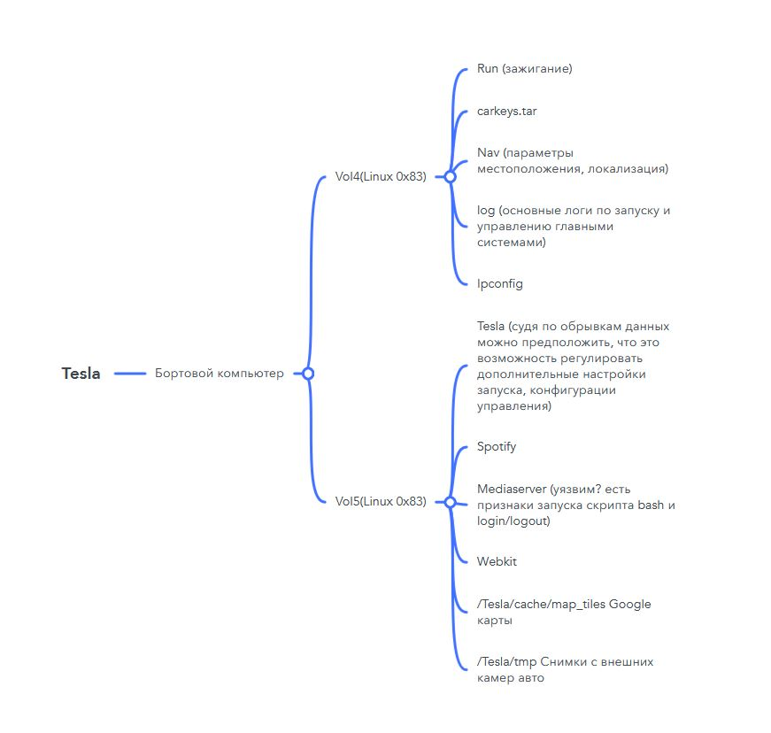
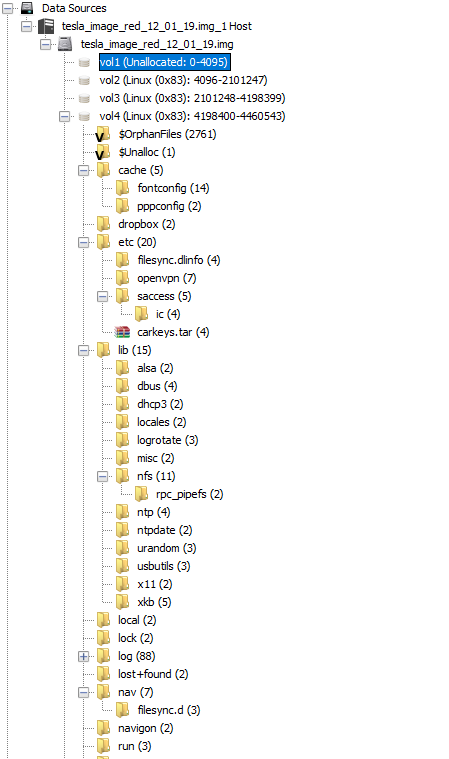
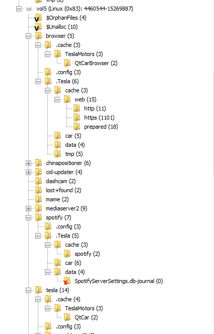
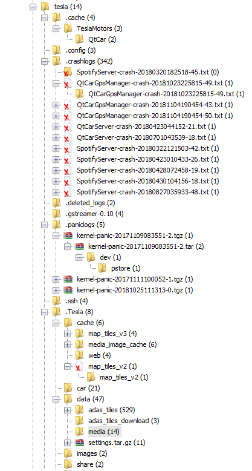

МИНИСТЕРСТВО НАУКИ И ВЫСШЕГО ОБРАЗОВАНИЯ РОССИЙСКОЙ ФЕДЕРАЦИИ

Федеральное государственное автономное образовательное учреждение 

высшего образования

**«Дальневосточный федеральный университет»**

**ШКОЛА ЦИФРОВОЙ ЭКОНОМИКИ**

**ОТЧЕТ** 

по лабораторной работе № 6

«Tesla»

|
Выполнили студенты гр. М9120-09.04.01кибер    

\_\_\_\_\_\_\_\_\_\_\_\_\_ Дрожжина А.П.

\_\_\_\_\_\_\_\_\_\_\_\_\_ Крюков Ю.М    

\_\_\_\_\_\_\_\_\_\_\_\_\_ Личковаха С. А.  
|
| :- |
|
Проверил преподаватель

\_\_\_\_\_\_\_\_\_\_\_\_\_ Зотов С.С.

\_\_\_\_\_\_\_\_\_\_\_\_\_\_\_\_\_\_\_\_\_\_\_\_\_\_ 

`                    `(оценка)

|

г. Владивосток

2022

Было обнаружено Chroot-окружение — это самый доступный способ запустить линукс внутри линукса (т.н. контейнер). Внутренняя система будет изолирована от основной только на уровне корневой файловой системы (rootfs). Сетевой стэк, псевдо-файловые системы /proc, /sys, /dev будут общими для хоста и контейнера. Поэтому не стоит считать chroot-окружение достаточной мерой для изоляции опасных/недоверенных приложений. Для этого больше подходит docker.

Основные риски:

- Из chroot-окружения можно убивать процессы хоста.
- Система из chroot-окружения имеет доступ к дисковым устройствам. Являясь рутом в контейнере, можно примонтировать блочное устройство хоста (какой-нибудь /dev/sda1) и делать с ним всё что угодно.

На 5 разделе диска, есть не совсем понятный скрипт 

Очень странно, что в самом автомобиле присутствует bash скрипт, где есть команды для обращения к каталогам и просмотру содержимого.

Для веб приложений используется jQuery старой версии и версия Drupal

jQuery v1.8.3, которая используется – данная версия позволяет загружать непроверенные файлы/код и тд. Является уязвимостью до версии 3.5

Drupal: CVE-2019-6341, CVE-2019-6339 – данные уязвимости связаны с произвольным выполнением удалённого кода.

Drupal.ajax позволяет осуществить SQL-инъекцию.

Уязвимость существует из-за ошибки при обработке входных данных в функции "Drupal.ajax()". Удаленный пользователь может с помощью специально сформированной ссылки выполнить произвольный код сценария в браузере жертвы в контексте безопасности уязвимого сайта.

Встречается также curl и скрипт heartbeat.sh, данный скрипт аналогичный можно скачать с гита, но не совсем понятно что он делает, а вытащить из дампа не предоставляется возможным. Происходит коннект с сервером, также есть сервисы позволяющие прослушать «сердцебиение» с помощью данного скрипта а также POST GET запросов. Существует Linux Heartbeat для повышения отказоустойчивости, либо действительно странный скрипт.

Вместе с этим, если обратить внимание на файлы crash, там также есть дополнительные команды которые требуют изучения. 

Системные настройки хранятся на 4 разделе, на 5 хранится информация по работе приложений, кэш, работа медиасерверов.

Были найдены результаты работы навигатора или карты

Также, можно предположить что именно данные сервисы используются в Тесле

